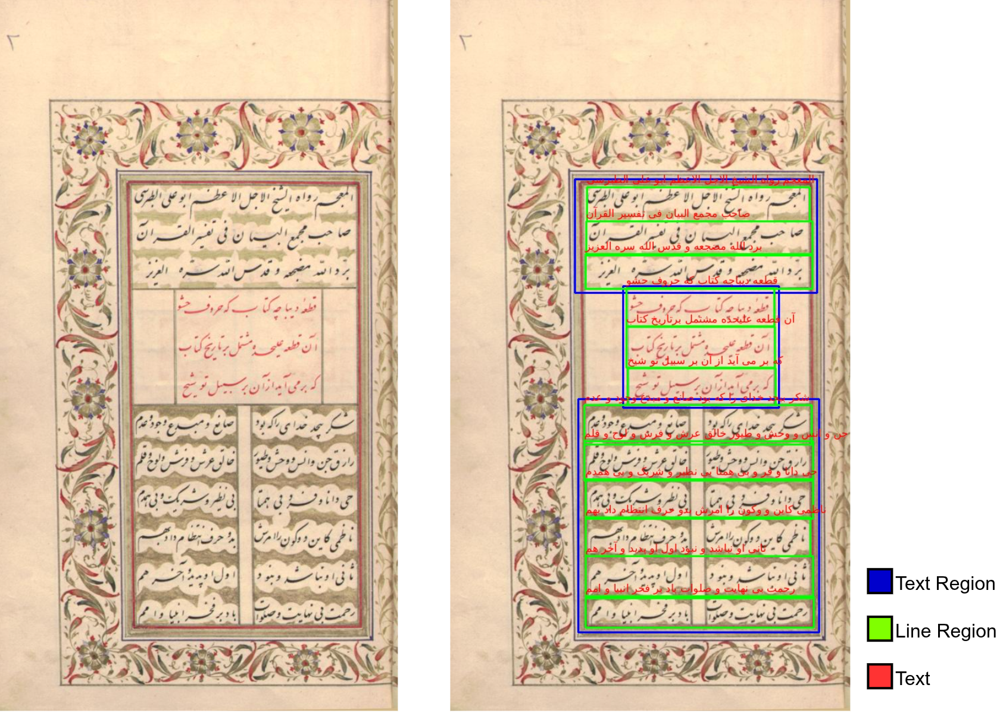

<h1 align='center'>A Historical Persian Handwritten Dataset and a Posterior-Based Baseline for Word Spotting with Line-Level Supervision</h1>

<br>

<div align='center'>
    <a href='#license'></a>
</div>

## Abstract

Large collections of historical Persian manuscripts have been digitized, but searching them is still slow and mostly manual. Historians usually want to find where a specific name, date, event, or topic appears, which is a word spotting problem rather than a full transcription problem. We introduce a new dataset of **223 pages, 3,678 lines, 37,631 words, and 130,630 characters**, collected from diverse historical Persian books of poetry and prose (e.g. the *Divan* of Hafez, the *Shahnameh*, *Majma al-Bayan*) and annotated by 11 annotators in Transkribus at the region, line, and text level.

We also propose a baseline that is trained **only with line-level annotations** but returns **word-level locations**. A fine-tuned line detector finds text lines, and a fine-tuned CRNN recognizer trained with CTC produces a frame-by-character posterior matrix for each line. Instead of decoding the most probable character at each frame, the query is scored directly against this matrix, so visually similar characters such as ب and پ no longer cause hard failures. The frame alignment also gives the position of the word inside the line and the page.



## Pipeline

1. **Line detection** — kraken BLLA model, fine-tuned on our PAGE XML line annotations.
2. **Recognition** — CRNN (CNN + BiLSTM + CTC), fine-tuned from the pretrained [`all_arabic`](https://zenodo.org/records/7050270) model.
3. **Posterior search** — the per-line `T × (|charset| + 1)` posterior matrix is kept (no decoding). The query is scored with a local CTC alignment that can start and end at any frame, and the matched frames give the word's horizontal position.

## Dataset

| Split | Pages | Lines | Words |
|---|---|---|---|
| Train | 144 | 2,329 | 24,301 |
| Validation | 35 | 614 | 6,079 |
| Test | 44 | 735 | 7,251 |
| **Total** | **223** | **3,678** | **37,631** |

Each page is a high-quality JPG scan with a PAGE XML file (exported from [Transkribus](https://www.transkribus.org/)) containing text regions, line regions, and line transcriptions. No word-level boxes are annotated.

## Results

**Line detection** (test set, IoU ≥ 0.3)

| Model | Precision | Recall | F1 | Mean IoU |
|---|---|---|---|---|
| Base model | 0.751 | 0.841 | 0.793 | 0.412 |
| **Ours** | **0.867** | **0.920** | **0.892** | **0.534** |

**Word spotting** (test set, 396 query words)

| Model | Search | Precision | Recall | F1 |
|---|---|---|---|---|
| Base model | Exact OCR | 0.627 | 0.043 | 0.080 |
| Base model | Posterior | 0.288 | 0.218 | 0.248 |
| **Ours** | Exact OCR | **0.857** | 0.340 | 0.487 |
| **Ours** | Posterior | 0.506 | **0.631** | **0.562** |

## Repository Structure

```
├── dataset
│   ├── train                          # page images + PAGE XML
│   └── test                           # page images + PAGE XML
├── WS_line_detection
│   ├── checkpoints
│   │   └── line_detection.safetensors
│   ├── preprocess_baseline.py         # add baselines to PAGE XML line regions
│   ├── preprocess_visualize_baseline.py  # QC overlay of baselines on pages
│   ├── train.sh                       # fine-tune BLLA (ketos segtrain)
│   └── evaluation.py                  # line detection P / R / F1 / IoU
└── WS_recognition
    ├── checkpoints
    │   └── recognition.safetensors
    ├── normalize_pages.py             # normalize transcriptions in PAGE XML
    ├── train.sh                       # fine-tune recognizer (ketos train)
    ├── test_posterior.py              # extract the posterior matrix of a line
    ├── evaluation.py                  # word spotting with posterior search
    ├── evaluation_ocr.py              # exact-OCR (decode-then-match) baseline
    └── search.py                      # interactive word search over pages
```

## ⚒️ Installation

### Environment

    Ubuntu 20 or 22, Python 3.10, CUDA-capable GPU

### Download the code

```bash
git clone https://github.com/saeed5959/persian_handwritten_dataset
cd persian_handwritten_dataset
```

### Install packages

```bash
pip install -r requirements.txt
```

## Line Detection

```bash
cd WS_line_detection

# 1) add baselines to the line regions of the PAGE XML files
python preprocess_baseline.py

# 2) visually check the baselines (optional)
python preprocess_visualize_baseline.py

# 3) fine-tune BLLA
bash train.sh

# 4) evaluate on the test set
python evaluation.py
```

## Recognition

```bash
cd WS_recognition

# 1) normalize the transcriptions
python normalize_pages.py

# 2) fine-tune the recognizer from all_arabic
bash train.sh

# 3) check posterior extraction on a sample line
python test_posterior.py
```

## Word Spotting Evaluation

Ten words are sampled randomly from each test page and searched in all lines of all test pages. Precision, recall, and F1 are reported.

```bash
cd WS_recognition

# posterior-based search (proposed)
python evaluation.py

# exact OCR baseline (decode, then match)
python evaluation_ocr.py
```

## Search

Search any word over a folder of pages. The script returns the page, the line, and the word position with a confidence score.

```bash
cd WS_recognition
python search.py
```

## Citation

```bibtex
@article{firouzi2026persianws,
  title={A Historical Persian Handwritten Dataset and a Posterior-Based Baseline for Word Spotting with Line-Level Supervision},
  author={Saeid Firouzi Daghigh and Majid Iranpour Mobarekeh},
  journal={IEEE},
  year={2026}
}
```

## License

The dataset is distributed under the [Creative Commons Attribution-NonCommercial 4.0 International (CC BY-NC 4.0)](https://creativecommons.org/licenses/by-nc/4.0/) license for research purposes. The page images are derived from digitized historical manuscripts, and any use of them should also respect the terms of the holding institutions.